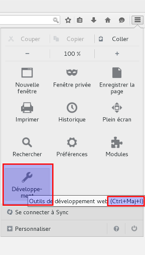

# Contenu de l'atelier de la semaine 4 | 45 min.

## Rapide retour sur les entités `html`

Lors des ateliers précédents, il a été remarqué que le caractère &laquo;&nbsp;&#9825;&nbsp;&raquo; ne s'affichait pas correctement dans la configuration de l'école. Il existe un moyen de contourner le problème : connaître la valeur décimale de ce caractère unicode.

Pour cela, consultez une table de caractère unicode en ligne, par exemple la *Table de caractères Unicode*^[[http://unicode-table.com/fr/](http://unicode-table.com/fr/). Ce lien est également indiqué sur *Moodle*, dans le bloc de droite intitulé *Les liens 'pubweb' d'Igor*.]

Dans cette table, sélectionnez les *Symboles divers*. Lorsque vous survoler le symbole choisi avec le curseur, vous constatez que le caractère &laquo;&nbsp;&#9825;&nbsp;&raquo; a une valeur unicode de `U+2661` et une valeur décimale de `9825`. À partir de ces éléments il est possible de constuire l'entité de caractère `html` suivante : `&9825;`.

## (Reprise) Création de *votre* feuille de style

Comment feriez-vous ? [Réponse en classe]

Dans la feuille de style que vous venez de créer, vous pouvez commencer par écrire un commentaire expliquant quel est ce fichier, qui l'a créé et éventuellement à quoi il sert. Vous pouvez vous inspirez de ce que vous trouvez dans le fichier `skeleton.css`.

Écrivez une règle pour centrer le texte du `footer`. Arrivez-vous à vous aider du document *Cascading Style Sheets (CSS3)* ?

```
footer {
	text-align: center;
}
```

## Les sélecteurs

Cette règle utilise un sélecteur de balise : `footer` renvoie à la balise `<footer>`. Elle s'applique dont à **toutes** les balises `<footer>` de votre site Web. Il est existe donc un sélecteur pour chaque balise `html`.

Écrivez ensuite une règle s'appliquant à l'élément *image*, afin d'entourer chaque image d'une bordure de 1px, arrondie sur les côtés.

```
img {
	border-width: 1px;
	border-style: solid;
	border-radius: 20px;
}
```

Pour cette règle, c'est encore le sélecteur de balise qui est utilisé. Les propriétés modifiées sont la largeur de la bordure, son style, et la courbure dans les angles. Vous pouvez vous référez aux *Quick Reference* ou au document en ligne *CSS Reference*^[[http://tympanus.net/codrops/css_reference](http://tympanus.net/codrops/css_reference)] pour découvrir les différents styles de bordures existants.

Avec le sélecteur choisi, cette règle s'applique à toutes les images du site Web, dont le logo du `header`. Pour appliquez une règle seulement à ce logo, une possibilité est d'utiliser un sélecteur d'identifiant.

Pour cela, il faut d'abord modifier le code `html`, à la fois dans le fichier `index.html` et `apropos.html`. Trouvez la ligne suivante (ce devrait être la ligne 40) :

```
<a href="index.html" "Retour à l'accueil"></a>
```

Ajoutez à la balise `` l'attribut `id=""` et donnez-lui la valeur "logo" :

```
<a href="index.html" "Retour à l'accueil"></a>
```

Il est nécessaire de répéter cette modification dans toutes les pages `html` de votre site. Une fois cela fait, il est désormais possible de créer un sélecteur spécifique à l'image de l'en-tête :

```
#logo {
	width: 6em;
	border: none;
	border-radius: 0px;
}
```

Le dièse signifie qu'il s'agit d'un sélecteur d'identifiant. L'identifiant ici étant bien "logo", le "nom" qui a été choisi pour *identifier* le logo. Les règles suivantes servent à remettre à zéro les règles qui s'appliquent aux images en général.

## Sélecteur de classe

Les identifiants permettent de distinguer un seul élément `html` par page. Afin de distinguer plusieurs balises d'une même page `html`, il faut utiliser la classe. Il s'agit également d'un attribut qui peut être ajouté à une balise : `class=""`. Le sélecteur de class, en `css`, est le point :

```
<article class="container">
	...
</article>

------------

.container {
	color: white;
	background-color: black;
}
```
Dans le fichier `css/skeleton.css` du *template* utilisé, se trouvent un certain nombre de classes :

   * `.container`, correspondant à `class="container"` dans le fichier `html`
   * `.column`
   * `.columns`
   * `.one.column`
   * `.two.columns`
   * `.buttons`
   * `.u-full-width`
   * `.u-max-full-width`
   * `.u-pull-right`
   * `.u-pull-left`
   * etc.

Elles correspondent à des mises en forment proposées par *Skeleton*. Elles peuvent être associées à n'importe quel contenant : `<div>`, `<article>`, `<section>`, `<header>`, `<footer>`, etc. La classe `"container"` a déjà été rencontrée.

```
.container {
  position: relative;
  width: 100%;
  max-width: 960px;
  margin: 0 auto;
  padding: 0 20px;
  box-sizing: border-box; }
```

Cette règle permet principalement de centrer l'élément désigné par la classe `container`.

## L'inspecteur de *Firefox*

Afin de mieux comprendre comment fonctionnent les règles s'appliquant à la classe container, il est possible d'utiliser l'inspecteur de *Firefox*

Les navigateurs modernes (*Mozilla Firefox* et *Google Chrome*) intègrent nativement des outils de développement qui peuvent vous êtres très utiles. Dans *Firefox*, ces outils se trouvent dans le menu, sous le bouton *Développement*, avec l'icône en forme de clé de garagiste. Le raccourci clavier est `CTRL+MAJ+I`.



Une fois le menu déployé, choisissez indifféremment les outils de développement ou l'inspecteur. Une fenêtre liée s'ouvre au bas de votre navigateur. Elle comprend trois éléments principaux :

   1. Une barre d'outil.
   2. Une fenêtre à gauche affichant le code `html` de la page inspectée.
   3. Une fenêtre à droite affichant les règles `css` appliquées.

L'inspecteur peut encore être affiché au moyen d'un clic-droit sur un élément d'une page Web dont vous voulez mieux comprendre le code, et en choisissant l'entrée *Examiner l'élément...*.

## La notion de boîte (*box*)^[Voir le document CSS - Théorie - Partie B, pt 2 et 3]

À l'aide de l'inspecteur, observez le menu de l'une de vos pages Web. Il est compris dans un élément `<div>` qui possède la classe `class="container"` :

   * À la `class="container"` du `html` correspond le sélecteur `.container` dans la feuille `css/skeleton.css`.
   * Essayez de décocher alternativement les règles appliquées, afin de déterminer lesquelles impactent la position de l'élément.

# Exercice pour la semaine prochaine

Insérez une icône à droite des liens externes, sur l'exemple de *Wikipedia*. Pour y parvenir, il est nécessaire de distinguer les liens externes des liens internes au moyen d'une classe. Une fois la classe implémentée dans le code `html`, il s'agit de créer une règle s'appliquant à cette classe au moyen du bon sélecteur. Pour l'image, vous pouvez soit utiliser l'image mise à disposition sur *Moodle* ou une autre que vous aurez trouvé sur le Web (préférez le format PNG ou SVG pour obtenir une transparence).

Pour réaliser les règles, vous pouvez chercher des informations sur les propriétés suivantes :

   * `background-image` ;
   * `background-position` ;
   * `background-size` ;
   * `background-repeat`.

Enfin, pensez à jouer avec les éléments de la boîte pour aligner l'image avec votre lien ! Bonne chance.
